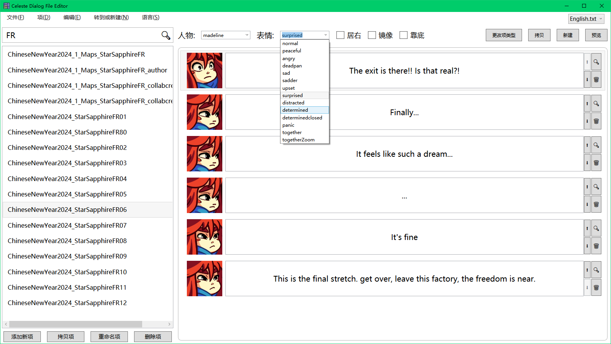

# Visual Celeste Cutscene

> A visual cutscene editor for *Celeste*.  
> 一个蔚蓝 *Celeste* 的可视化的剧情编辑器

> **Note that this project is still in early development**  
> **注意项目仍在极早期的开发中**

[English Section](#features)

## 功能

- **可视化对话编辑器**：使用可视化编辑器创建和编辑对话
  - 在下拉框中直接选择角色和表情
  - 简单地设置人物的 `left` 或 `right`，`anchor` 和 `flip` 属性
  - 在右键菜单中将指令 `{>>}`、`{#BADFF4}` 和 `{~}` 等直接环绕到文本中
  - ~~快速比较不同语言的对话文件并找到差异~~
  - 使用 `预览` 按钮快速在游戏中预览剧情
- ~~**搭积木式剧情编辑器**：就像在 Scratch 中一样使用积木创建和编辑剧情动作~~
  - ~~通过拖放方式来安排剧情动作~~
  - ~~与对话编辑器进行直接交互~~
  - ~~憋不出来其他描述了，毕竟这项目连开工计划都还暂时没有~~

## 构建

1. 准备好 .NET 8.0 SDK
2. 直接构建 `VisualCelesteCutscene.csproj` 然后没了

## LICENSE

项目使用 [MIT License](LICENSE.txt)。

> 然后似乎就没东西说了

----

## Features

- **Visual Dialog Editor**: Create and edit dialogs in a visual editor
  - Select characters and emotions directly in a combo box
  - Set `left` or `right`, `anchor`, and `flip` with a check box
  - Surround commands like `{>>}`, `{#BADFF4}`, `{~}` easily in the contextmenu
  - ~~Compare dialogs of different languages and find differences quickly~~
  - Preview dialogs in-game with just one click
- ~~**Blockly Cutscene Editor**: Create and edit cutscenes in a visual editor blockly~~
  - ~~Arrange cutscene actions with drag and drop~~
  - ~~Direct interaction with dialog editor~~
  - ~~I don't know anything else since it's not started at all~~

## Building

1. Prepare .NET 8.0 SDK.
2. Build `VisualCelesteCutscene.csproj` and that's all.

## License

This project is licensed under the [MIT License](LICENSE.txt).